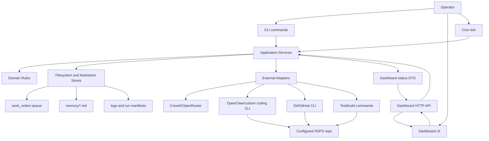
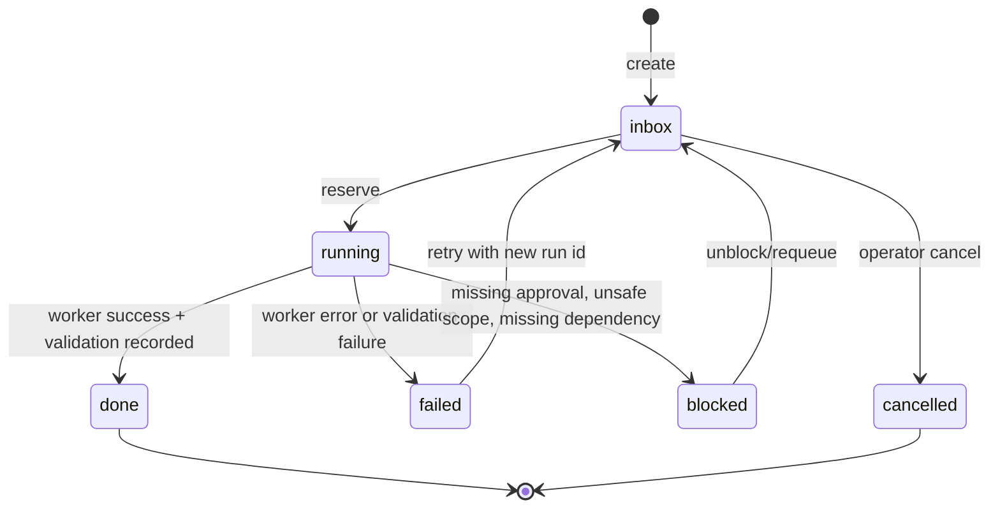

# Target Architecture

Daedalus is a local AI game-development studio for RSPS work. Its architecture should preserve the current lightweight Python package, static dashboard, Markdown memory, and filesystem queue while making ownership boundaries explicit enough for autonomous agents, tests, and future integrations to operate safely.

The target is not a large rewrite. The next architecture should extract stable domain and service seams from the current scripts, then let CLI, cron, dashboard, CrewAI, and future integrations call the same application services.

## Current Shape

The repository already contains the main product pieces:

- `src/rsps_crewai_team/crew.py`: CrewAI planning pipeline and OpenRouter model routing.
- `src/rsps_crewai_team/main.py`: `rsps-team` planning CLI.
- `src/rsps_crewai_team/worker.py`: work-order queue consumption, OpenClaw execution, duo mode, Git worktree handling, and queue state transitions.
- `src/rsps_crewai_team/cron.py`: scheduled worker entrypoint and cron file rendering.
- `src/rsps_crewai_team/dashboard.py`: static dashboard server plus JSON API.
- `src/rsps_crewai_team/dashboard_static/`: static operational UI, assets, manifests, and live dashboard rendering.
- `src/rsps_crewai_team/runtime/`: shared settings, filesystem work orders, coding worker adapter, Git sync, and Ponytail policy.
- `docs/`: workflow, safety, data schema, orchestration, dashboard build plan, and UI/asset contracts.
- `memory/`: Markdown project memory, decisions, open questions, failed attempts, and task graph.
- `work_orders/`: filesystem queue with `inbox`, `running`, `done`, and `failed`.
- `evals/`: planned validation harness.

The current design is functional but has several implicit boundaries:

- Queue state is a filesystem convention, not a domain contract.
- Worker orchestration mixes domain decisions, prompt construction, adapter execution, Git sync, and queue transitions.
- Dashboard API reconstructs state directly from environment, Git, logs, and work-order files.
- CLI, cron, and dashboard actions call implementation modules directly instead of a shared application service.
- Frontend state now renders real API data with explicit empty states; any future seeded demo state must be labeled and opt-in.
- Memory and task graph are documented but not yet updated through a stable service.
- Safety gates exist, but approval, autonomy, dry-run, destructive action, and high-risk task classification are not centralized.
- Evaluation expectations exist, but no common event log or run manifest ties work orders to tests, logs, commits, and review outcomes.

## Architectural Goals

1. Keep Daedalus local-first and inspectable.
2. Make every write path explicit, gated, and testable.
3. Treat Markdown memory and work orders as first-class data, not incidental files.
4. Let every interface reuse the same services: CLI, dashboard API, cron, CrewAI, future MCP/n8n nodes, and skills.
5. Separate domain policy from adapters such as CrewAI, OpenClaw, Git, cron, HTTP, and static UI.
6. Preserve small vertical slices. Avoid introducing a database, web framework, or JS framework until the filesystem model is clearly exhausted.
7. Provide stable contracts for autonomous agents: ownership, inputs, outputs, state transitions, logs, safety checks, and evals.

## Target Module Boundaries

The package should evolve toward these modules:

```text
src/rsps_crewai_team/
  domain/
    work_order.py
    task_graph.py
    agent.py
    run.py
    policy.py
    memory.py
  services/
    planning_service.py
    work_order_service.py
    execution_service.py
    dashboard_service.py
    memory_service.py
    readiness_service.py
    evaluation_service.py
  adapters/
    crewai_adapter.py
    coding_worker_adapter.py
    git_adapter.py
    filesystem_store.py
    markdown_store.py
    shell_adapter.py
    clock.py
  interfaces/
    cli/
      team.py
      worker.py
      cron.py
      git.py
      ponytail.py
    http/
      dashboard_api.py
    dashboard_static/
      ...
  config/
    agents.yaml
    tasks.yaml
  runtime/
    compatibility wrappers during migration
```

This is a target boundary map, not a required immediate directory rename. The first migration can keep existing files and introduce services one at a time.

### Domain Layer

The domain layer should contain pure models and rules with no subprocess calls, no environment reads, and no direct filesystem mutation.

Core domain objects:

- `WorkOrder`: id, title, body, status, created_at, updated_at, risk, owner_role, dependencies, source, related_run_ids.
- `WorkOrderStatus`: `inbox`, `running`, `blocked`, `done`, `failed`, `cancelled`.
- `Run`: id, work_order_id, agent_id, mode, started_at, ended_at, status, prompt_path, log_path, repo_path, worktree_path, commit_sha, exit_code, validation_summary.
- `AgentRole`: role id, display name, capability, write scope, model policy, safety level.
- `TaskGraph`: nodes, dependencies, owners, status, risk, acceptance criteria.
- `SafetyPolicy`: autonomy flag, dry-run flag, high-risk rules, allowed actions, required approvals.
- `MemoryEntry`: path, section, summary, links, updated_at.

Domain rules:

- A work order can move from `inbox` to `running` only through reservation.
- A `running` work order must end as `done`, `failed`, `blocked`, or `cancelled`.
- A write-capable run requires `RSPS_ALLOW_AUTONOMOUS=true`, a configured RSPS repo, and a passing safety gate.
- High-risk RSPS surfaces require explicit review metadata: economy, trade, bank, shop, admin commands, packets, persistence, cache/client edits.
- Parallel runs must have disjoint write scopes or isolated worktrees.
- Logs and status payloads must never expose secrets or full `.env` contents.

### Services Layer

Application services should own workflows and coordinate adapters.

| Service | Responsibility |
|---|---|
| `PlanningService` | Convert operator requests into planning packets and candidate work orders using CrewAI. |
| `WorkOrderService` | Create, reserve, move, list, and inspect work orders through a repository interface. |
| `ExecutionService` | Run one work order, run duo mode, construct worker prompts, enforce safety gates, call coding adapters, and record run metadata. |
| `ReadinessService` | Report Java, Git LFS, OpenClaw, RSPS repo, Git remote, env flags, build/test command availability, and toolchain state. |
| `DashboardService` | Compose the full dashboard status view from work orders, runs, readiness, Git, logs, agents, and memory summaries. |
| `MemoryService` | Read and update Markdown memory files with bounded sections and decision/task graph updates. |
| `EvaluationService` | Run smoke checks, schema checks, configured RSPS build/test commands, and eval scenarios; attach results to runs. |
| `SafetyService` | Centralize autonomy checks, dry-run policy, unsafe request routing, high-risk classification, and destructive action blocking. |

No CLI or HTTP handler should perform business logic that cannot be reused by another interface.

### Adapter Layer

Adapters should be thin and replaceable:

- `CrewAIAdapter`: wraps `RspsCrew().crew().kickoff(...)` and returns a planning result object.
- `CodingWorkerAdapter`: wraps OpenClaw or custom coding CLI invocation.
- `GitAdapter`: wraps status, worktree creation/removal, commit, push, and branch summaries.
- `FilesystemStore`: persists work orders, run manifests, and queue lists.
- `MarkdownStore`: reads/writes memory and docs sections.
- `ShellAdapter`: runs configured build/test/readiness commands with bounded output and timeouts.
- `Clock`: provides timestamps for deterministic tests.

Adapter outputs should be structured dataclasses or dictionaries, not raw strings unless the raw output is explicitly bounded and marked as log text.

## Target Data Flow



## State Ownership

| State | Current Location | Target Owner | Notes |
|---|---|---|---|
| Work-order queue | `work_orders/{inbox,running,done,failed}` | `WorkOrderService` via `FilesystemStore` | Keep filesystem layout, add metadata front matter or sidecar manifest when needed. |
| Run records | `logs/*.prompt.md`, `logs/*.worker.log` | `ExecutionService` | Add `logs/runs/<run-id>.json` for structured linkage among work order, prompt, log, agent, exit code, commit, and evals. |
| Project memory | `memory/*.md` | `MemoryService` | Keep Obsidian-compatible Markdown; update through bounded section operations. |
| Agent role config | `config/agents.yaml` | `PlanningService` and `AgentRegistry` | Dashboard display roles should derive from the same registry when possible. |
| Task definitions | `config/tasks.yaml` | `PlanningService` | Keep CrewAI YAML but wrap outputs in planning result DTOs. |
| Runtime settings | `.env`, env vars | `Settings` object | Load once at interface boundary; pass typed settings to services. |
| Readiness | live env/tool/git checks | `ReadinessService` | Cache only within one request; do not persist volatile state unless recorded in run manifests. |
| Dashboard UI state | browser memory | frontend controller | UI should render server state only; demo/mock mode must be explicit. |
| Dashboard assets/manifests | `dashboard_static/assets`, JSON manifests | static asset system | Validate with asset and JSON checks before release. |
| Evals | `evals/`, run outputs | `EvaluationService` | Attach eval results to run manifests and dashboard status. |

## Work-Order Lifecycle



Lifecycle requirements:

- Reservation should be atomic for filesystem storage. A file move is acceptable locally, but the service should expose it as `reserve_next(...)`.
- Every run should create a run id before invoking a worker.
- Prompt files and worker logs should be referenced by run manifest, not discovered by filename guesses.
- Duo mode should reserve separate work orders. If two agents ever work on the same objective, they must use isolated worktrees and produce separate run manifests for manual merge.
- Retries should create a new run id and preserve the prior failed run.

## API Boundary

The existing dashboard API can remain:

- `GET /api/status`
- `POST /api/enqueue`
- `POST /api/action`

Target changes should be additive and backward compatible.

Recommended DTOs:

- `DashboardStatus`: project, env, readiness, queue, runs, agents, git, logs, memory, evals.
- `QueueStatus`: counts and bounded item summaries by status.
- `RunSummary`: run id, work order title, agent, status, started_at, ended_at, exit_code, log tail, commit, validation state.
- `ActionResult`: ok, action, pid or run_id, log path, precondition report.
- `ReadinessReport`: named checks with status, severity, detail, and remediation.

API rules:

- Do not expose secrets, raw `.env`, full prompts, or unbounded logs.
- Validate all POST bodies before calling services.
- Return precondition failures as structured errors, not only log text.
- Keep action allowlists server-side.
- Add explicit `demo_mode` if mock data remains visible.
- Treat build/test execution as a gated action with command allowlist, timeout, and log capture.

Future endpoints, when needed:

- `GET /api/work-orders/{id}`
- `POST /api/work-orders/{id}/retry`
- `POST /api/work-orders/{id}/cancel`
- `GET /api/runs/{id}`
- `GET /api/memory/summary`
- `POST /api/action` with `run-build`, `run-tests`, and `evaluate` once safety gates exist.

## CLI Boundary

Current scripts should stay stable for operators:

- `rsps-team "...request..."`
- `rsps-worker enqueue ...`
- `rsps-worker run-once`
- `rsps-worker run-duo`
- `rsps-worker status`
- `rsps-cron tick|render|install`
- `rsps-git status|init`
- `rsps-ponytail status|set`
- `rsps-dashboard`

Target CLI behavior:

- CLI modules parse args and print results only.
- Services perform all state transitions.
- CLI output should include ids and paths useful for follow-up.
- Status commands should return a concise human format now and may later support `--json`.
- Dangerous commands should print failed preconditions before attempting execution.

## UI Boundary

The static dashboard is the right near-term UI choice. Its target boundary is:

- Browser controller fetches `/api/status` and renders view models.
- Browser never infers real operational state from mock files.
- Mock/demo content must be explicitly labeled and disabled for real operation.
- UI actions call allowed API actions only.
- Confirmation and precondition displays should be rendered before write-capable actions.
- Dashboard panels should map cleanly to service-owned state: Studio, Queue, Runs/Builds, Git, Cron, Settings, Memory/Evals.

The frontend should not know filesystem paths beyond display fields returned by the API. It should not construct shell commands or agent prompts.

## Integration Seams

Daedalus needs explicit seams for future integrations without binding the core to them:

- GitHub: use `GitAdapter` or a future `GitHubAdapter` for PR creation, check status, branch links, and issue references.
- Linear/Notion/Slack: treat as optional notification or planning adapters fed by service DTOs.
- n8n/MCP: expose service operations as reviewable nodes/tools; no direct filesystem mutation outside services.
- Skills: local `skills/<skill-name>/SKILL.md` should define repeatable procedures that call CLI/API services instead of duplicating orchestration logic.
- RSPS repo: always accessed through configured path, safety gates, build/test commands, Git adapter, and worker adapter.

## Safety And Trust Boundaries

Centralize these checks in `SafetyService`:

- `RSPS_ALLOW_AUTONOMOUS` gates all write-capable worker runs.
- `RSPS_WORKER_DRY_RUN` should be supported before first execution on a new repo.
- `RSPS_REPO_PATH` must exist and be a Git repository before commits or worktrees.
- High-risk work orders require review metadata and may require manual approval.
- Destructive file operations, credential access, offensive security, unauthorized scanning, evasion, and persistence are blocked by policy.
- Prompt construction must include scoped work order content, Ponytail policy, safety constraints, repo path, and expected validation; it must not include secrets.
- Log tails shown in the UI must be bounded and scrubbed.
- Git push remains opt-in through `RSPS_GIT_PUSH_AFTER_WORK`.

## Evaluation And Observability

Each worker run should be observable without scraping loose logs.

Run manifest example:

```json
{
  "run_id": "20260616T120000Z-rsps-builder-add-bank-tabs",
  "work_order_id": "20260616T115500Z-add-bank-tabs",
  "agent_id": "rsps-builder",
  "mode": "run-once",
  "status": "failed",
  "started_at": "2026-06-16T12:00:00Z",
  "ended_at": "2026-06-16T12:09:31Z",
  "repo_path": "/absolute/path/to/rsps",
  "worktree_path": null,
  "prompt_path": "logs/20260616T120000Z-rsps-builder-add-bank-tabs.prompt.md",
  "log_path": "logs/20260616T120000Z-rsps-builder-add-bank-tabs.worker.log",
  "exit_code": 1,
  "commit_sha": null,
  "validation": {
    "build": "not_run",
    "tests": "not_run",
    "evals": "not_run",
    "summary": "worker exited before validation"
  }
}
```

Minimum eval targets:

- Dashboard API schema checks for `/api/status`, `/api/enqueue`, and `/api/action`.
- Work-order lifecycle tests for create, reserve, move, retry, and failure preservation.
- Safety gate tests for disabled autonomy, missing repo, unsafe action, and high-risk classification.
- Prompt construction tests that assert required policy context and secret exclusion.
- Git adapter tests using a temporary repository.
- Dashboard smoke checks for empty queue, configured repo, dirty repo, missing tools, and action failure.

## Incremental Migration Plan

### Phase 1: Stabilize Contracts

- Add `docs/TARGET_ARCHITECTURE.md` as the shared architecture contract.
- Add typed DTOs or dataclasses for work orders, readiness, dashboard status, and worker results.
- Add tests around current work-order filesystem behavior.
- Make dashboard mock/demo fallback explicit.
- Add structured precondition results for dashboard actions.

### Phase 2: Extract Services Without Changing Interfaces

- Move queue operations behind `WorkOrderService`.
- Move dashboard status assembly behind `DashboardService`.
- Move readiness checks behind `ReadinessService`.
- Move worker execution flow behind `ExecutionService`.
- Keep existing CLI command names and HTTP routes.

### Phase 3: Add Run Manifests And Evals

- Create `logs/runs/<run-id>.json` for each worker action.
- Attach prompt path, worker log path, exit code, worktree path, commit result, and validation summary.
- Add `EvaluationService` and basic smoke/schema checks.
- Show recent run summaries in dashboard status.

### Phase 4: Memory And Task Graph Integration

- Add `MemoryService` for bounded updates to `memory/PROJECT_MEMORY.md`, `DECISIONS.md`, `OPEN_QUESTIONS.md`, `FAILED_ATTEMPTS.md`, and `TASK_GRAPH.md`.
- Let planning output propose work orders and task graph updates.
- Require meaningful architecture, safety, or workflow changes to record memory updates.

### Phase 5: Integration Adapters

- Add optional adapters for GitHub PR/check visibility and Slack/Notion/Linear updates only after local contracts are stable.
- Expose service operations as future MCP/n8n nodes through the same DTOs and safety gates.
- Add `--json` CLI outputs where external tools need stable machine-readable responses.

## Non-Goals

- No database until filesystem state causes real concurrency, query, or audit limitations.
- No web framework until the dashboard API outgrows `ThreadingHTTPServer`.
- No JS framework until the static frontend becomes harder to validate than replace.
- No direct production deployment path.
- No offensive security tooling or unsafe automation.
- No protected game branding in shipped UI.

## Acceptance Criteria

The target architecture is reached when:

- CLI, cron, dashboard API, and future integrations call shared services.
- Work-order lifecycle, worker runs, readiness, safety gates, and dashboard status have typed contracts.
- Every autonomous write has a run manifest, prompt path, log path, safety result, and validation result.
- Dashboard state is generated from real services or explicitly labeled demo mode.
- Memory updates are deliberate and bounded.
- Tests cover lifecycle, API schema, safety gates, and at least one end-to-end dry-run or temporary-repo worker path.
